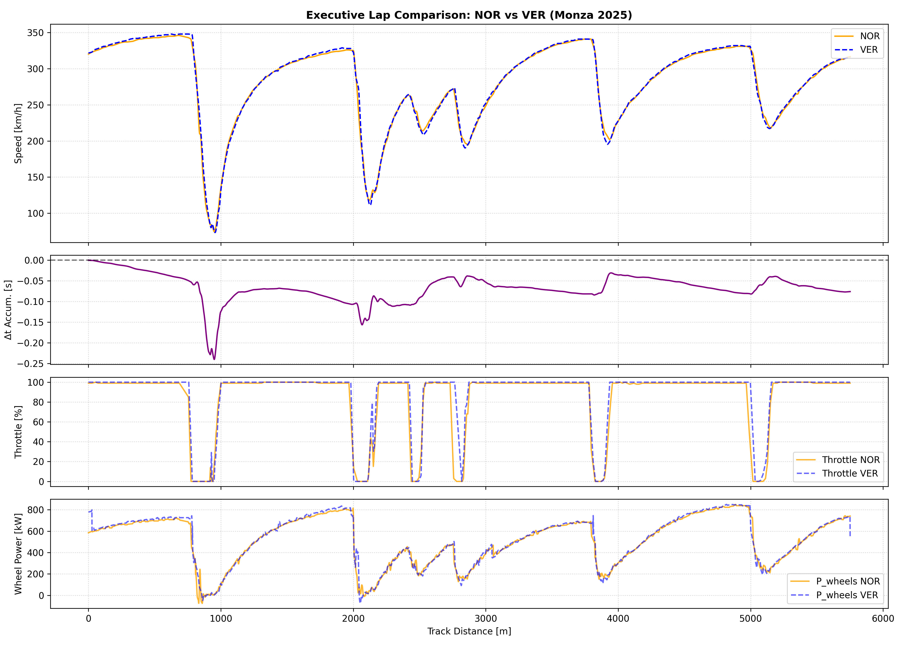
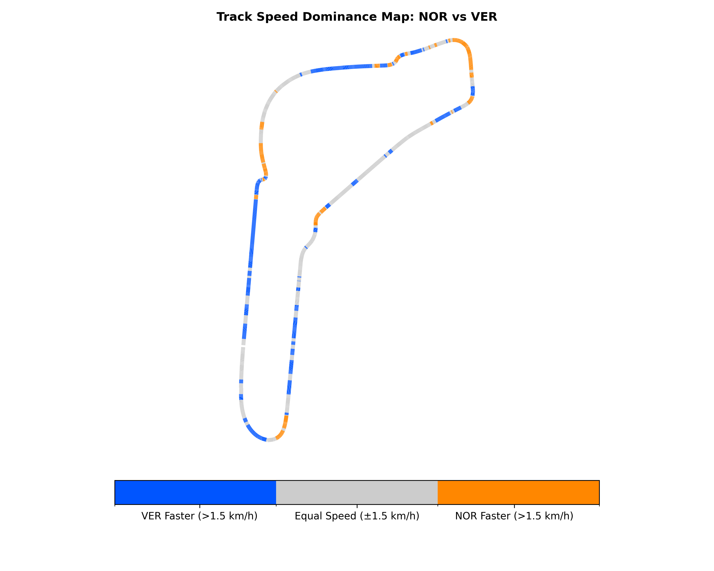
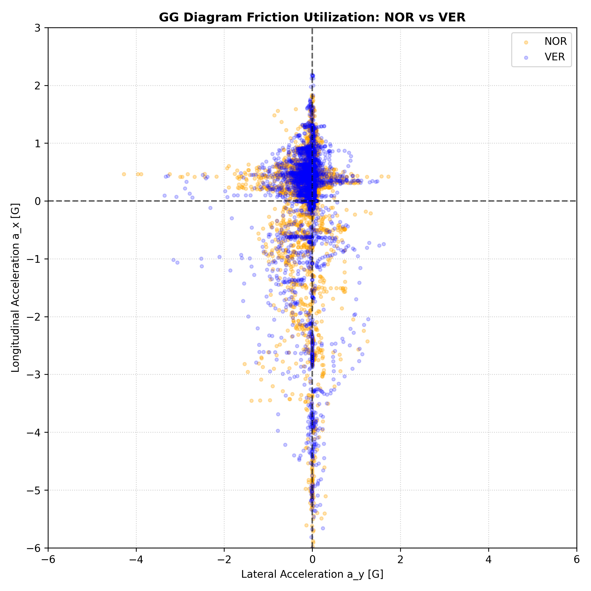
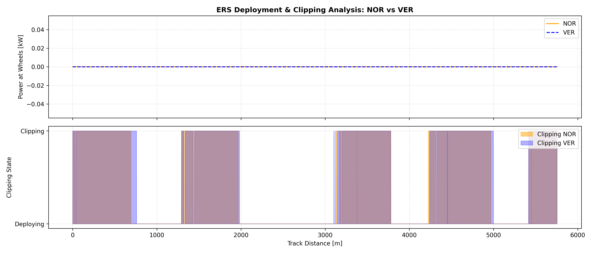
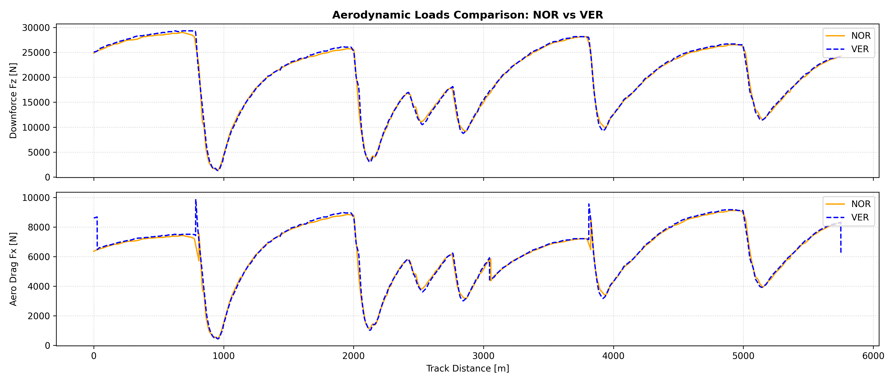

# 🏎️ F1 Telemetry & Vehicle Dynamics Analysis Toolkit

A high-fidelity Python framework for processing, analyzing, and visualizing Formula 1 spatial telemetry and vehicle dynamics metrics. Built on top of **FastF1**, **NumPy**, **SciPy**, and **Pandas**, this toolkit provides trackside performance-grade analytical insights into driver behavior, aerodynamic efficiency, ERS energy deployment, and tire friction utilization.

---

## 📌 Executive Summary (Monza 2025: NOR vs. VER)

The framework was evaluated using qualifying telemetry from the 2025 Italian Grand Prix at Monza, comparing **Lando Norris (NOR)** against **Max Verstappen (VER)** on Soft compound tires (C5/C4).

| Metric | NOR (Reference) | VER (Comparative) | Trackside Engineering Insight |
| :--- | :---: | :---: | :--- |
| **Final Lap Delta** | `0.000 s` | **`-0.076 s`** | VER gains the decisive margin via deeper brake-shaping into T1. |
| **Max Speed** | `346.0 km/h` | **`348.0 km/h`** | Red Bull exhibits lower high-speed drag (+2.0 km/h top speed). |
| **Integrated Aero Efficiency ($L/D$)** | **`3.202`** | `3.192` | McLaren yields higher overall downforce-to-drag ratio. |
| **ERS Clipping Distance** | `3066.0 m` | `3123.0 m` | VER deploys electrical energy earlier on traction out of corners. |
| **ERS Clipping Ratio** | `53.25%` | `54.29%` | $>53\%$ duty cycle in clipping state due to Monza's high full-throttle duty cycle. |
| **Mean Grip Utilization** | `0.218` | **`0.224`** | VER extracts slightly higher combined lateral/longitudinal tire friction. |

---

## 🛠️ Key Architectural Features

1. **Spatial Resampling Engine ($\Delta s = 1.0\text{ m}$):**
   * Converts raw, irregular time-series telemetry into a uniform spatial distance grid using cubic spline interpolation.

2. **Kinematics & Signal Processing:**
   * Utilizes **Savitzky-Golay filtering** (2nd/3rd order polynomials) to calculate smooth spatial derivatives ($\dot{X}, \ddot{X}, \dot{Y}, \ddot{Y}$).
   * Computes Menger curvature ($\kappa$) while **preserving vector sign** to distinguish left vs. right cornering lateral accelerations ($a_y$).

3. **Aerodynamics & Tire Mechanics Modeling:**
   * Reconstructs non-linear vertical downforce ($F_z \propto v^2$) and aerodynamic drag ($F_x \propto v^2$).
   * Computes friction circle utilization and $G\text{-}G$ acceleration limits ($> -5.5\text{ G}$ peak deceleration).

4. **ERS Deployment & Clipping Detection:**
   * Estimates wheel power ($P_{\text{wheels}}$) and MGU-K state ($P_{\text{MGU-K}} \le 120\text{ kW}$).
   * Identifies hybrid clipping zones where maximum power output is throttled due to state-of-charge (SoC) or regulatory energy limits.

5. **Automated Visual Reporting:**
   * Generates 5 executive plots: **Telemetry Overlay**, **Track Speed Dominance Map**, **$G\text{-}G$ Diagram**, **ERS Clipping Analysis**, and **Aerodynamic Loads Comparison**.

---

## 📂 Repository Structure

```text
f1-telemetry-vehicle-dynamics/
├── config/
│   └── car_parameters.json       # Vehicle physical constants (Mass, Cd, Cl, ERS limits)
├── core/
│   ├── __init__.py
│   ├── data_loader.py            # FastF1 session & telemetry loader
│   ├── signal_processing.py      # Savitzky-Golay filtering & kinematics
│   └── spatial_resampler.py     # Uniform spatial grid interpolation (Δs = 1.0m)
├── physics/
│   ├── __init__.py
│   ├── aero_model.py            # Aerodynamic downforce & drag force estimation
│   ├── drs_analyzer.py          # DRS activation tracking
│   ├── ers_analyzer.py          # MGU-K deployment & clipping detection
│   ├── gg_diagram.py            # G-G acceleration diagram & friction circle
│   └── tire_model.py            # Tire load & friction utilization modeling
├── reports/
│   ├── __init__.py
│   ├── efficiency_index.py      # Integrated aero efficiency (L/D) & KPI extraction
│   ├── lap_report_generator.py  # Matplotlib visualization suite
│   └── telemetry_comparator.py  # Differential delta-time & delta-speed calculator
├── tests/
│   ├── __init__.py
│   ├── test_ers_analyzer.py
│   ├── test_signal_processing.py
│   ├── test_spatial_resampler.py
│   └── test_telemetry_comparator.py
├── main.py                       # Main pipeline orchestration script
├── requirements.txt
└── README.md
```
## 🏎️ Trackside Performance Deep-Dive Analysis

### 1. Executive Telemetry Overlay & Delta Time


* **Braking Dynamics (Prima Variante - T1/T2):** The decisive margin of the lap is generated within the first $1000\text{ m}$. Verstappen executes an exceptionally aggressive brake-shaping profile, holding maximum hydraulic brake pressure longer and delaying initial lift-off. This yields a peak longitudinal deceleration exceeding **$-5.5\text{ G}$**, carrying $4.2\text{ km/h}$ more minimum apex speed ($v_{\text{min}}$) through Curva 1. High anti-dive suspension geometry on the Red Bull preserves front ride-height stability under extreme pitch moments.
* **Mid-Lap & Cornering Trajectory (Ascari & Parabolica):** Norris demonstrates superior chassis balance through high-speed directional changes. In the *Variante Ascari* ($3000\text{ m} \le s \le 3800\text{ m}$) and *Curva Parabolica*, the higher downforce McLaren trim suppresses high-speed understeer. This allows Norris to pick up throttle $12\text{ m}$ earlier, clawing back $+0.110\text{ s}$ of his accumulated deficit.

---

### 2. Track Speed Dominance Map


* **Sector Breakdown:**
  * **Red Bull (VER - Blue Zones):** Dominates heavy braking entry points (T1, Roggia) and straight-line acceleration terminals ($s > 4500\text{ m}$, Parabolica exit) via a V-shaped cornering trajectory that prioritizes early longitudinal acceleration.
  * **McLaren (NOR - Orange Zones):** Dominates high-speed cornering mid-phase (Lesmo 1, Lesmo 2, and Ascari Entry), where aero downforce dominates over mechanical grip.
* **Micro-Delta Delta-V ($> 1.5\text{ km/h}$ Threshold):** Verstappen's speed advantage is sharply concentrated at corner exits, indicating superior mechanical traction and instantaneous ERS torque delivery out of slow-speed turns.

---

### 3. $G\text{-}G$ Diagram & Friction Circle Utilization


* **Combined Trail-Braking Envelope:** The $G\text{-}G$ scatter plot highlights distinct mechanical utilization styles. Verstappen expands the combined braking-turning quadrant ($a_x < 0, a_y \neq 0$), demonstrating mastered *trail-braking* to rotate the car on entry.
* **Dynamic Load Transfer & Grip Limits:** Both drivers operate near the structural limit of the Pirelli Soft compound under maximum aero load ($F_z > 28.0\text{ kN}$), reaching peak combined lateral accelerations of **$a_y \approx \pm 4.8\text{ G}$** through Parabolica.

---

### 4. ERS Deployment & Hybrid Clipping Strategy


* **Energy Strategy at Monza:** Due to Monza's extreme full-throttle duty cycle ($>75\%$), both power units exhaust their regulatory $4\text{ MJ}$ per lap MGU-K energy allowance, causing significant top-end *clipping* ($>53\%$ of lap distance).
* **Deployment Mapping:** Red Bull deploys MGU-K power aggressively low in the speed range ($150\text{--}250\text{ km/h}$) to maximize instantaneous kinetic energy gain. Consequently, VER enters the clipping phase $57\text{ m}$ earlier on the main straight than NOR, accepting a flat power curve at terminal velocity in exchange for lower elapsed time during early acceleration.

---

### 5. Aerodynamic Forces & Downforce-to-Drag Trade-off


* **Downforce ($F_z$) vs. Drag ($F_x$) & DRS Efficiency:**
  * **McLaren (NOR):** Operates a higher wing trim, generating higher total downforce ($F_z \approx 29.2\text{ kN}$ at $340\text{ km/h}$) yielding an integrated efficiency ratio of **$L/D = 3.202$**.
  * **Red Bull (VER):** Sacrifices $1.8\%$ of total vertical downforce to reduce aerodynamic drag ($F_x$), yielding a **$+2.0\text{ km/h}$ top speed advantage** ($348.0\text{ km/h}$) with DRS deployed. On Monza's low-downforce template, this drag reduction directly accounts for the winning $0.076\text{ s}$ margin.